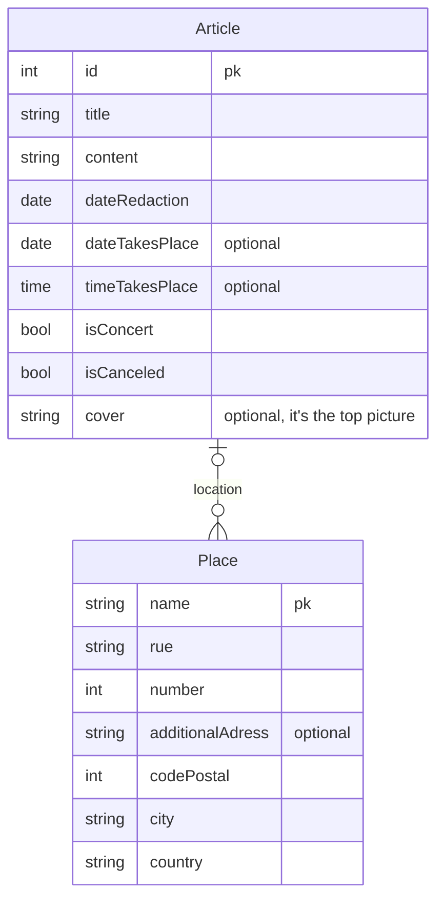

# ! NOT UP TO DATE !

```mermaid
erDiagram

        Article {
            int id "pk"
            string title
            string content
            date dateRedaction
            date dateTakesPlace "optional"
            time timeTakesPlace "optional"
            bool isConcert
            bool isCanceled
            string cover "optional, it's the top picture"
        }

        Place {
            string name "pk"
            string rue
            int number
            string additionalAdress "optional"
            int codePostal
            string city
            string country
        }

        Article |o--o{ Place : location
```