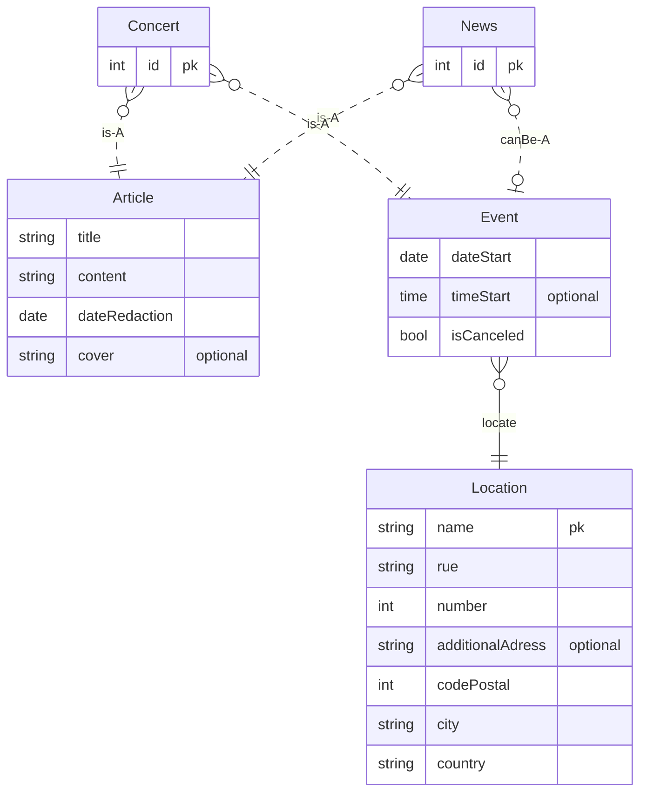

# ER diag scheduled for the back-end

```mermaid
erDiagram

        Concert {
            int id "pk"
        }

        News {
            int id "pk"
        }

        Article {
            string title
            string content
            date dateRedaction
            string cover "optional"
        }
        
        Event {
            date dateStart
            time timeStart "optional"
            bool isCanceled
        }

        Location {
            string name "pk"
            string rue
            int number
            string additionalAdress "optional"
            int codePostal
            string city
            string country
        }

        Concert }o..|| Article : is-A
        News }o..|| Article : is-A
        Concert }o..|| Event : is-A
        News }o..o| Event : canBe-A
        Event }o--|| Location : locate

```